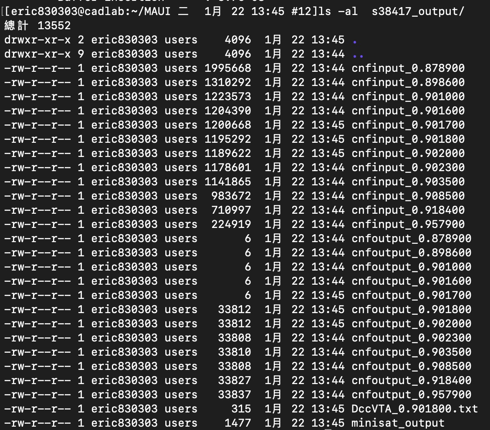

# MAUI
The program is the implementation of our framework "Making aging useful, intentionally" proposed in DATE

## Contact
1. Name: Tien-Hung, Tseng
2. Email: eric830303.cs05g@g2.nctu.edu.tw 

## Outline
* [Files and Directories](#1)
* [Introduction to the arguments in commandline](#2)
* [Introduction to the parameters in `/setting/Parameters.txt`](#3)
* [Example of running the program](#4)
* [Process variations](#5)
* [Aging model](#6)

## <h2 name="1"> Files and Directories </h1>
* The executable is named `maui`

* The 2 executables of SAT solver are located in the dir `MINISATs/`. One can be run on OSX, the other can be run on Linux.

* You can ignore the existence of the directory `gnuplot/`, which contains the PVs (process variations) results of the benchmarks, after applying our framework. We upload the directory here, because there exist some scripts of gnuplot to generate the figures.

* Make sure that directories `obj/`, `src/`, `setting/` are located at the same path with `maui`. The directory `obj/` does not exist here/github. You must create it youself by linux command `mkdir obj`.

* Run `make` to compile/link the source/object codes in directories `src/` and `obj/`. Also, while you are running `make`, the script will automatically detect the current platform (i.e., operating system), and put the proper executable of SAT solver from the `MINISATs/` to the current dir.

* Run `make clean` to remove object codes in `obj/` 

* Our program input is the timing report of the benchmark, e.g., `s38417.rpt`. I do not upload them here due to large file size. Please contact me if you need them.

* The main output of our program is a directory, which contains the CNF clauses from iteration to iteration of binary search, and DCC deployment and high-Vth leader selection.


## <h2 name="2"> Introduction to the arguments in commandline</h2>
You can see all arguments by running `./maui -h` in the commandline. 

Here, we only introduce commonly-used arguments.

1. `-h`: see the argument.

2. Let our optimization framework only targets the specific groups of aging-critical paths.
	* `-path=onlyff`: Our framework only optimizes the critical paths, starting from FFs to FFs.
	* `-path=pi_ff`: Our framework optimizes the critical paths, starting from FFs to FFs, and starting from PI(primary input) to FFs.
	* `-path=all` (default): Our framework targets all groups of critical paths.

3. `-nonVTA`: VTA denotes "Vth assignment" for the clock buffers. Our framework incorporates the techniques of DCC deployment and Vth assignment at default, for aging tolerance. Thus, `-nonVTA` forces the framework not to do Vth assignment for clock buffers.

4. `-nodcc`: The argument is similar to the above one `-nonVTA`. `-nodcc` forces the framework not to do DCC deployment.

5. `-dc_for`: Let the framework consider the situations that, the duty cycles, generated from DCCs, are impacted by the aging of DCCs. For example, the duty cycle generated from an 80% DCC will not be exactly 80%, if the aging impact of DCC is considered.
6.  `-CG`: Add clock gating in the framework.


## <h2 name="3"> Introduction to the parameters in `/setting/Parameters.txt` </h3>
1. `FIN_CONVERGENT_YEAR`: Used in the aging model. It denotes "finally convergent year".
2. `EXP`: Used in the aging model. It denotes the exponential term in the aging model.
3. `BASE_VTH`: Used in the aging model. 
4. `DC_1_Nf`, `DC_2_Nf` and `DC_3_Nf`: They denote the duty cycles generated from DCCs, if the aging impact of DCC is NOT considered.
5. `DC_1_F`, `DC_2_F` and `DC_3_F`: They denote the duty cycles generated from DCCs, if the aging impact of DCC is considered (i.e., argument`-dc_for`)
6. `LIV_VTH_TECH_OFFSET`: The Vth offset between nominal Vth and high Vth.

## <h2 name="4"> Example of running the program </h4>
If you wanna do the experiment with the following conditions:

1. Benchmark: `s38417.rpt`
2. Optimized group of aging-critical paths: The critical paths from FF to FF (i.e., `-path=onlyff`)
3. Do not apply the technique of Vth assignment for aging tolerance. (i.e., `-noVTA`)
4. Consider the aging impact of DCC on the duty cycle. (i.e., `-dc_for`)

Hence, the corresponding command is as follows:

`./maui -path=onlyff -nonVTA -dc_for s38417.rpt`

Then, if you wanna apply the technique of Vth assignment in the framework. The corresponding command:

`./maui -path=onlyff -dc_for s38417.rpt`

Further, if you wanna see the influence of clock gating (i.e., `-CG`) on the experimental result. The corresponding command:
`./maui -path=onlyff -dc_for -CG s38417.rpt`

The results will be shown on the screen of your terminal. Moreover, the program will automatically generate a directory, named with `s38417_output`, which contains the files recording CNF clauses, resulting DCC deployments and leader selections.


## <h2 name="5"> Process Variations </h5>
In the section, we focuss on analyzing the impact of PVs (process variations) on the aging tolerance.

Let's see an example.

After applying the our framework on `s38417.rpt` with the following cmd:

`./maui -path=onlyff s38417.rpt`

A directory, named with `s38417_output/` is generated.


In the directory, the dcc deployments and leader selections are recoreded in the file `s38417_output/DccVTA_0.901800.txt`, where the last few characters `0.901800` represents the optimized clock period of the benchmark `s38417`.



Then, please copy the content in `s38417_output/DccVTA_0.901800.txt` to `setting/DccVTA.txt`, which the analysis utility of our program will read at default.


Then, do PV analysis with the following cmd:
`./maui -path=onlyff -PV s38417.rpt`

Then, there are some interaction between the user and the program, by some interactive inputs! (i.e, the count of Monte-Carlo instances, fresh Tc..etc)


The Tc\_fresh and Tc\_aged can be refered to the experimental results.


The output of the PV analysis utility is a file, named with `Imp_dist.txt`, meaning "improvement distribution"


Then, you can use the gnuplot to plot the improment distributions of Monte-Carlo instances. The template of the gnuplot script (*.gp) can be refered to the dir `gnuplot/`

## <h2 name="6"> Aging model </h6>
The aging model can be referred to the function `getAgingRate_givDC_givVth()`, which is located in the file [src/clocktree.cc](./src/clocktree.cc)

```c++
double ClockTree::getAgingRate_givDC_givVth( double DC, int Libindex, bool initial, bool caging )
{
	if( DC == -1 || DC == 0 ) DC = this->DC_N ;
	if( initial )
	{
        //---- Sv ------------------------------------------------------
        double Sv = 0 ;
        if( this->_usingSeniorAging == true  )
            return (1 + (((-0.117083333333337) * (DC) * (DC)) + (0.248750000000004 * (DC)) + 0.0400333333333325));
        
        if( Libindex != -1 )
        {
            if( DC == this->DC_1 )
                Sv = this->getLibList().at(Libindex)->_Sv[7] ;
            ....
        }
        else
        {
            if( DC == this->DC_1 )
                Sv = this->getLibList().at(0)->_Sv[0] ;
            else if( DC == this->DC_2 )
            .....
         }
        
        //---- Vth offset -----------------------------------------------
        double Vth_offset = 0 ;
        if( Libindex != -1 )
            Vth_offset = this->getLibList().at(Libindex)->_VTH_OFFSET + this->getBaseVthOffset() ;
        else
            Vth_offset = this->getBaseVthOffset() ;
        //---- Aging rate -----------------------------------------------
        double Vth_nbti = ( 1 - Sv*Vth_offset )*( 0.0039/2 )*( pow( DC*( 315360000 ), this->getExp() ) );
        double agr = 0 ;
        if( Libindex == -1 )    agr = (1 + Vth_nbti*2 + 0 ) ;
        else                    agr = (1 + Vth_nbti*2 + 2*this->getLibList().at(Libindex)->_VTH_OFFSET ) ;
		
		
        if( Libindex == -1 ){
            if(      DC == this->DC_N )	this->_nominal_agr[2] = agr ;
            else if( DC == this->DC_1 )	this->_nominal_agr[0] = agr ;
            .....

        }else{
			this->_HTV_fresh = (1 + 2*this->getLibList().at(Libindex)->_VTH_OFFSET ) ;
            if(      DC == this->DC_N ) this->_HTV_agr[2] = agr  ;
            else if( DC == this->DC_1 )	this->_HTV_agr[0] = agr  ;
            ...
        }
        return agr ;
    }else//initial
    {
		
        if( Libindex == -1 )
        {
        	if( caging == false )	return 1 ;
        	else if( DC == this->DC_N )	return this->_nominal_agr[2] ;
            ...
          else if( DC == this->DC_3_age )return this->_nominal_agr[6] ;
			else
			{
				double conv_Vth = this->calConvergentVth( DC, this->getExp() ) ;//80% DCC
				double Sv = 0;
				double Vth_offset = this->getBaseVthOffset() ;
				Sv = this->calSv( DC , this->getBaseVthOffset(), conv_Vth ) ;
				double Vth_nbti = ( 1 - Sv*Vth_offset )*( 0.0039/2 )*( pow( DC*( 315360000 ), this->getExp() ) );
				double agr = (1 + Vth_nbti*2 + 0 ) ;
				return agr;
			}
			
        }else
        {
			if( caging == false )	return this->_HTV_fresh  ;
          else if( DC == this->DC_N ) return this->_HTV_agr[2] ;
          else if( DC == this->DC_2_age ) return this->_HTV_agr[6] ;
			else
			{
				double conv_Vth = this->calConvergentVth( DC, this->getExp() ) ;//80% DCC
				double Sv = 0;
				double Vth_offset = this->getLibList().at(Libindex)->_VTH_OFFSET + this->getBaseVthOffset() ;
				Sv = this->calSv( DC , this->getLibList().at(Libindex)->_VTH_OFFSET + this->getBaseVthOffset(), conv_Vth ) ;
				double Vth_nbti = ( 1 - Sv*Vth_offset )*( 0.0039/2 )*( pow( DC*( 315360000 ), this->getExp() ) );
				double agr = (1 + Vth_nbti*2 + 2*this->getLibList().at(Libindex)->_VTH_OFFSET )  ;
				
				return agr;
			}
        }
    }
    return -1 ;
}
```
       
        


